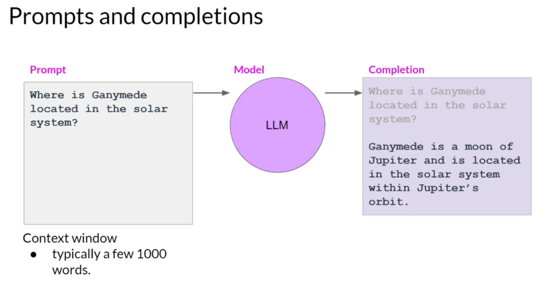
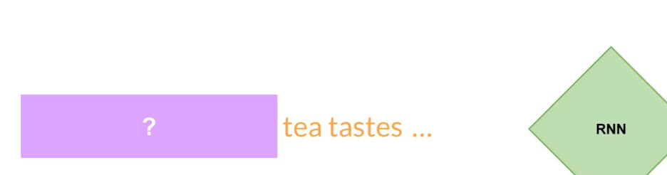
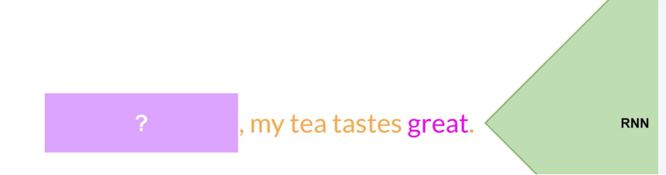
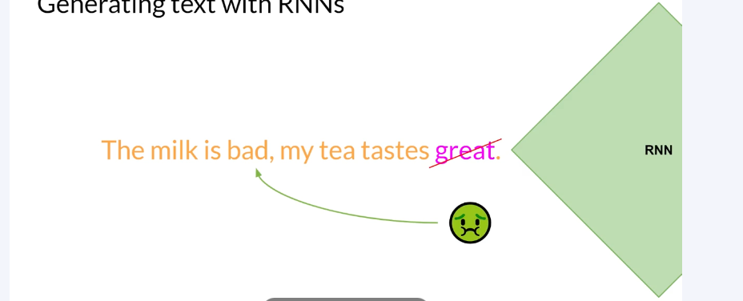
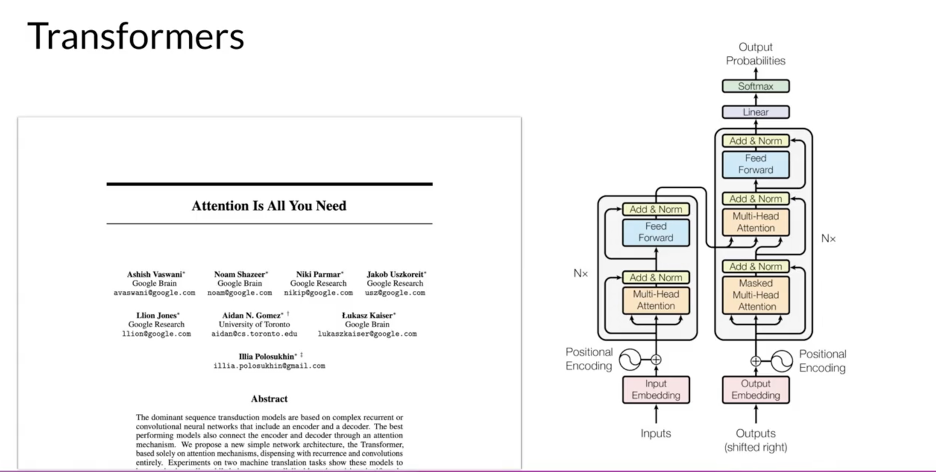

Week 1: 
LLM : Large Language Model
Generative Ai: Sub branch of machine learning
Introduction to LLMs and the generative AI project lifecycle

 

Use cases: 
-	Text generation (Ask model to generate an essay) 
-	Text summarization
-	Translation b/w languages (English-Spanish)
-	Translate natural language to Machine Code
-	Information retrieval, Identify people and places ( NER : Named entity recognition, a kind of word classification) 
-	Connect to external data sources or using to invoke external API (to provide model with information it don’t know from pre-training) 
•	LLM subjective understanding increase with increase of no of parameters it’s trained on , but it's also true that smaller models can be fine tuned to perform well on specific focused tasks

Text generation before transformers:
-	Previous generations of language made use of an architecture called RNN (Recurrent Neural Networks) 
-	RNN were limited by the amount of compute and memory needed to perform well at generative tasks
-	RNN carrying out a simple prediction generative task:
-	 
-	RNN did good here, but significantly scaled the resources
-	 
-	But it failed here , even after scaling:  

-	To successfully predict the next word, models need to see more than just the previous few words. Models needs to have an understanding of the whole sentence or even the whole document.
-	The problem here is that language is complex. In many languages, one word can have multiple meanings. These are homonyms.
-	 
-	Words within a sentence structures can be ambiguous or have what we might call syntactic ambiguity.  

-	Did the teacher teach using the book or did the student have the book, or was it both? How can an algorithm make sense of human language if sometimes we can't?
-	Well in 2017, after the publication of this paper, Attention is All You Need, from Google and the University of Toronto, everything changed. The transformer architecture had arrived. This novel approach unlocked the progress in generative AI that we see today. 
-	 
-	Scale efficiently 
-	Parallel Process
-	Attention to input meaning 

